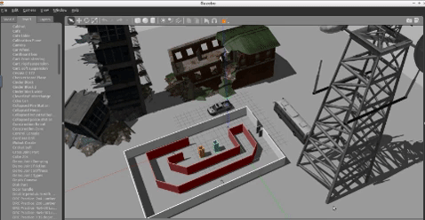
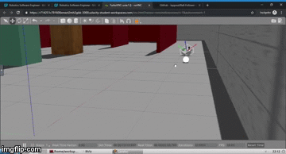

# Robotics
Compendium of robotic projects in ROS

 
    

[//]: # (-------------------Reference List------------------------------)
[//]: # (Image Directory Paths)
[image1]: ./README_images/gazebo.gif
[image2]: ./README_images/ball_follower.gif
[image3]: ./README_images/AMCL.gif
[image4]: ./README_images/RTAB.gif

[//]: # (Repo URL Links)
[link1]: https://github.com/laygond/GazeboProject
[link2]: https://github.com/laygond/Ball-Follower-Robot
[link3]: https://github.com/laygond/Adaptive-Monte-Carlo-Localization
[link4]: https://github.com/laygond/GraphSLAM-RTABmap

# Projects

Simple Lane Detection | Advanced Lane Detection 
:---:|:---:
 |  

Traffic Sign Classifier | Behavioral Clonning
:---:|:---:
 |  

# ROBOTA Team

 
  

